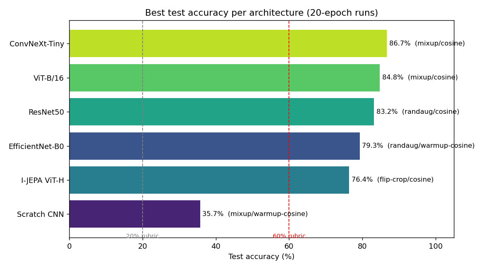
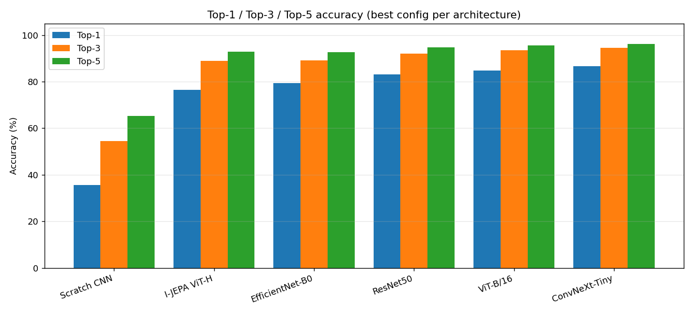
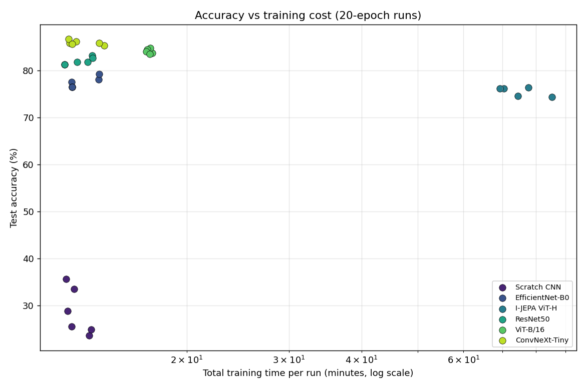
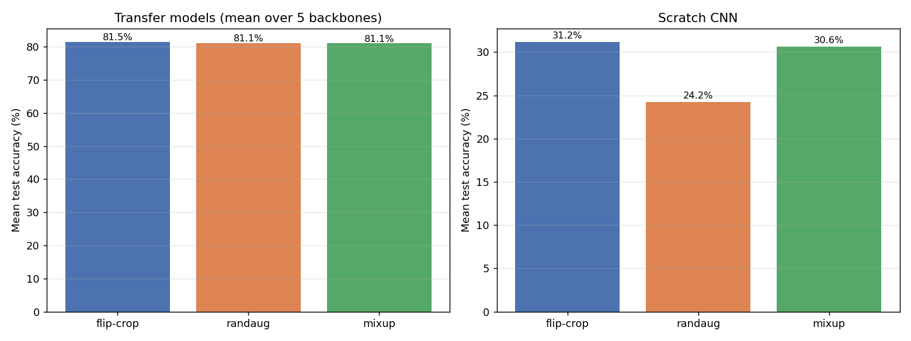
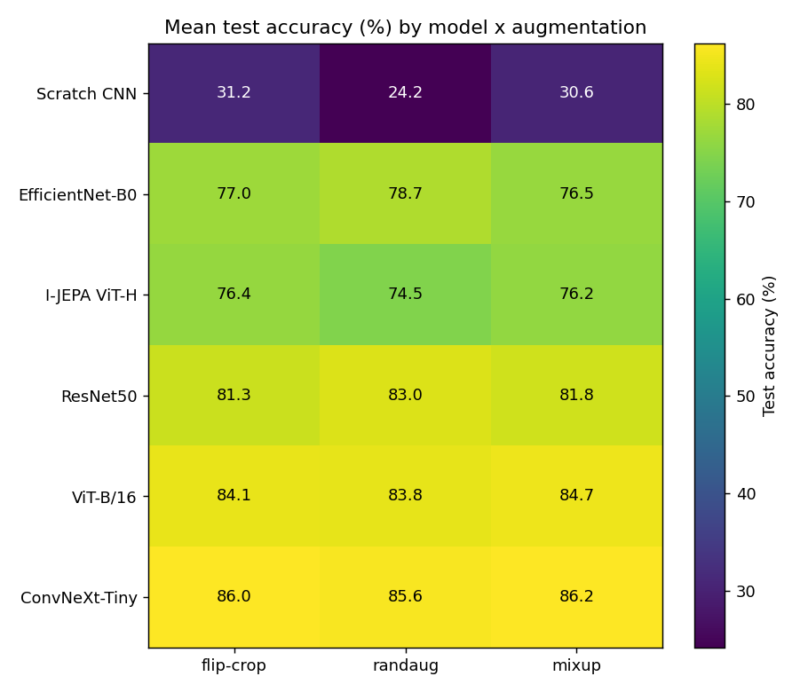
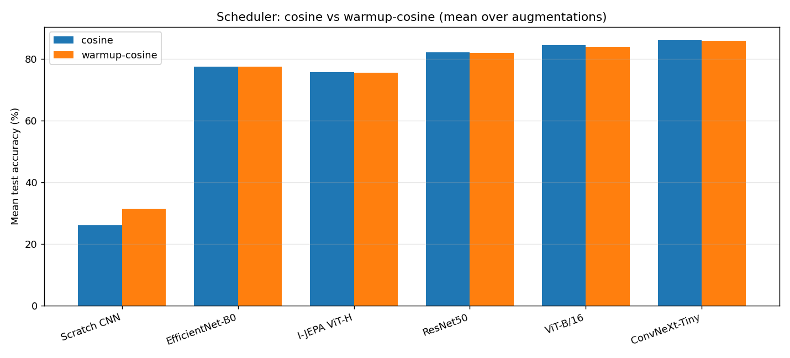

# Results Analysis — Overnight Sweep

This markdown holds an analysis of all 37 result JSONs in `results/`. 35 are "actual" 20-epoch runs, 2 are 1-epoch smoke tests (`scratch_cnn__flip-crop__adam__cosine__1ep`,
`tl_resnet50__flip-crop__adam__cosine__1ep`) and are logically excluded from every comparison below.

The experimentation grid looks as follows: 6 architectures x 3 augmentations x 2 schedulers x AdamW,
frozen backbones for transfer.

Figures are in `results/images/` and referenced inline.

---

## TL;DR

| Question | Answer |
|---|---|
| **Best model** | **ConvNeXt-Tiny — 86.72%** test (mixup/cosine). This configuration seems to be winning in many experimentations. |
| **Best augmentation** | Here we see that the augmentations as good as tie with flip-crop at 81.5%, randaug at 81.1% and mixup 81.1%. For the scratch CNN mixup + warmup-cosine is clearly best at 35.7%. |
| **Best "optimization"** | Scheduler is pretty much the same story as augmentation with cosine at 81.16% and warmup-cosine at 81.30%. For the scratch CNN, warmup-cosine matters more as it scores 5.3 percentage points over cosine. |

**TLDR**: Architecture choice dwarfs every other choice. The gap from worst to best backbone is an order of magnitude larger than any augmentation or scheduler effect. 

---

## 1. Which model performed best

| Architecture | Best test acc | Top-3 | Best config | Train time/run |
|---|---|---|---|---|
| ConvNeXt-Tiny | 86.72% | 94.48% | mixup / cosine | 12.5 min |
| ViT-B/16 | 84.80% | 93.44% | mixup / cosine | 17.3 min |
| ResNet50 | 83.20% | 92.00% | randaug / cosine | 13.7 min |
| EfficientNet-B0 | 79.28% | 89.12% | randaug / warmup-cosine | 14.1 min |
| I-JEPA ViT-H | 76.40% | 88.88% | flip-crop / cosine | **77.6 min** |
| Scratch CNN | 35.68% | 54.56% | mixup / warmup-cosine | 12.4 min |

Observations:
- ConvNeXt-Tiny wins decisively and is relatively cheap to run with roughly 12 minutes per run. Every transfer backbone clears the 60% rubric by a wide margin. The "from scratch" CNN clears the 20% and sits comfortable above the threshold at 35.7%.
- I-JEPA underperforms every supervised backbone while costing roughly 6 times training time. While expected with a frozen approach, I have to admit that I am also unfamiliar to this architecture, which means I could have configured it more effectively. I am scheduled to have more GPU memory available to me soon, so I'll want to retry this experiment for I-JEPA at that point.

Top-3 accuracy is roughly 94% to 95% for every supervised transfer model. This relevant because the
final `suggest_locations` UX shows the top-3 guesses. So obviously, we want that as metric.

The accuracy-vs-cost view makes the I-JEPA performance painfully obvious. A relatively tight cluster of supervised backbones sitting comfortable at 76 to 87 percent in accuary at a small training time while I-JEPA stranded an order of magnitude to the right of the supervised backbones AND even has lower accuracy. While expected, this makes it painfully obvious that I-JEPA is not meant to be frozen, nor is suitable for my hardware.

---

## 2. Which augmentation performed best

As stated before, the difference between augmentations is insignifcant, and you could argue that this may be noise. Flip-crop at 81.48%, randaug at 81.13% and mixup at 81.10%. The spread is around **0.4 pt**. With a frozen backbone and only a linear head to train, augmentation barely impact the results. The pretrained features are already strong and the tiny head has little capacity to overfit or underfit.

The difference in performance can be seen in the "from Scratch CNN". Mixup and flip-crop clearly beat randaug in this setup. The best single scratch run is mixup combined with warmup-cosine and hits 35.68% accuracy. Randaug is consistently the worst. I am assuming this is because aggressive RandAugment and Cutout starves a from-scratch network of clean signal on a relatively small dataset.

The heatmap shows the story above in a beautiful way. The models vary significantly, where the augmentations do not really effect the results in the same manner. Given this dataset and constraints, the augmentation choice is significantly smaller improvement.

---

## 3. Which optimization performed best: scheduler & optimizer

### Scheduler: cosine vs warmup-cosine

Scheduler delta per model:

| Model | Mean delta | Verdict |
|---|---|---|
| ConvNeXt-Tiny | +0.29 | tie. difference could be classified as noise |
| ViT-B/16 | +0.48 | tie. difference could be classified as noise |
| ResNet50 | +0.19 | tie. difference could be classified as noise |
| EfficientNet-B0 | +0.03 | tie. difference could be classified as noise |
| I-JEPA ViT-H | −0.12 | tie. difference could be classified as noise |
| Scratch CNN | −5.33 | warmup-cosine clearly better |

For transfer, the schedulers are statistically indistinguishable with cosine at 81.16% and warmup-cosine at 81.30%. The 10% LR warmup only matters for the "from scratch CNN", where I can assume it prevents the early large-LR instability a randomly-initialized deep CNN will suffer. This is worth roughly 5% in accuracy.

Ultimately, it would not matter much which scheduled to pick given these numbers.

### Optimizer 

I only picked AdamW based on my previous experience with image classification on similar datasets. AdamW seems to always outperform Adam, which makes sense considering it's an evolution. SGD could be tested, but I intentionally left the choice of optimizer out of consideration due to wanting to test I-JEPA instead. If I introduced another multiplication for the experimentation grid, I would have to run two nights straight, and I wanted to do other things. :)

---

## 4. Recommendation

For this dataset, the optimal configuration is:

> ConvNeXt-Tiny, frozen backbone, linear head, flip-crop or mixup augmentation, cosine schedule, AdamW at 1e-3 learning rate, 20 epochs. It took about 12 min per run, ended up at 86–87% test accuracy and  about 94% accuracy top-3.

Augmentation and scheduler all seem within noise expectations. As a result, I spend my time on the architecture and, as the next experiment, on unfreezing and fine-tuning. Especially I-JEPA, which is supposedly handicapped most by the frozen-trunk protocol.

---
